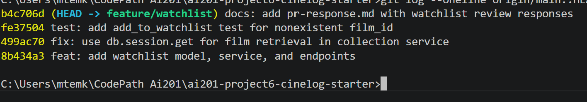

# PR Response Doc — CineLog Watchlist Feature

## AI Usage
<!-- Fill in at the end — how you used AI tools during this project -->
I used AI to help me verify the changes I made. For instance, I used AI to help write the curls to confim that the deduplication code I added worked properly and prevented two of the same WatcListEntry from populating in the database. I also asked Claude to help me question the reasonin I arrived at for Checkpoints 4 & 5. I asked Claude to check for any gaps in my reasoning. I also had a few problems rebasing my changes, so I asked claude to help sove the merge requests that were stemming from the .gitignore file.

## Comment 1 — Rename
**What I did:**: I used the search feature to look up all instances of save_to_watchlist() and changed them to add_to_watchlist().
**How I verified:**: I made sure the app compiled/ran and ran the /<user-id>/add POST api to confirm the method was working

## Comment 2 — Deduplication
**What I did:** I added a deduplication check to add_to_watchlist(). I queried the WatchListEntries by the given user_id and film_id to see if an entry already existed. If the entry already exists, then I raised a foundInCollection error.
**How I verified:** I asked claude to verify the deduplication error. I asked the AI to specifically use curl commands to check if the deduplication code works, it tried to add two records with the same user_id and film_id but got an exception when the secound one was attempted to be added

## Comment 3 — Missing test
**What I did:**: I created a new test_watchlist.py file and added the necessary imports for the Errors and the add_to_watchlist function. I created an isolated test app and some example films and users to use in testing. Then, I tested the add_to_watchlist() function by passing an unknown film id and making sure the function riased a FilmNotFound error    
**How I verified:** I verified this by running the test_watchlist.py and saw that all the tests had passed successfully

## Comment 4 — Default visibility
**My position:** I want the default value of 'public' on the WatchListEntry model to default to TRUE.
**Reasoning:** I believe that the default view of watchlist should be Public because this is a community-driven project. The main reason that people log movies/join this app is to see what their friends and community are watching/want to watch. If the deafault if private then their will be a lot less viewable watchlist entries and decrease community engagement
**Tradeoff acknowledged:** The tradeoff is that users who explictly want their watchlist to be private may have to click a button or make an extra step to ensure that every movie they add would be set to private. We can add another feature to make a user's watchlist private potentially.

## Comment 5 — Sort order
**My position:** I agree with your position that the WatchList order should default to 'date added'
**Reasoning:** I think that the default order should be 'date added' because most people want to see what the added recently. I would also like to add that other user's would like the context of seeing what movies a user has added recently which may coincide with trends about certain types of movies. This would also increase the given engagement on the app.
**Engagement with reviewer's point:** I agree with with your reasoning because I feel like a user would expect their watchlist entries to sort by date and not by movie title alphabetically. Order by movie title may be confusing.

## Comment 6 — Rebase
**What conflicted:** The .gitignore conflicted with the one I already had due to some minor differences. The main file that conflicted was the models.py file since that is where the incoming changes were made.
**How I resolved it:** I accepted the changes made to the models.py file and made sure they reflected the new UUID changes instead of integer
**How I verified no conflict remains:**

## PR Description
<!-- Written at the end — feature overview, design decisions, manual testing steps -->
Adds a **watchlist** feature to CineLog, letting users save films they want to watch later (distinct from the existing collection of films they've already watched). The branch also rebases onto `main` to pick up the integer→UUID film-ID migration.

- **New `WatchlistEntry` model** (`models.py`) — stores `user_id`, `film_id`, `date_added`, and a `public` visibility flag. IDs use UUID strings to stay consistent with the migrated schema.
- **Watchlist service** (`services/watchlist_service.py`) — `add_to_watchlist()` and `get_watchlist()` business logic.
- **Watchlist endpoints** (`routes/watchlist/watchlist.py`) — `POST /watchlist/<user_id>/add` and `GET /watchlist/<user_id>`.
- **Tests** (`tests/test_watchlist.py`) — cover the add flow and error handling.

- **Watchlist vs. collection are separate concepts** — a film can be on a watchlist and later added to the collection, so they use independent models rather than a shared table with a status flag.
- **UUID film IDs** — the restored `WatchlistEntry.film_id` matches `CollectionEntry.film_id` (`String(36)`) so both foreign keys reference the migrated `Film.id`.

 

